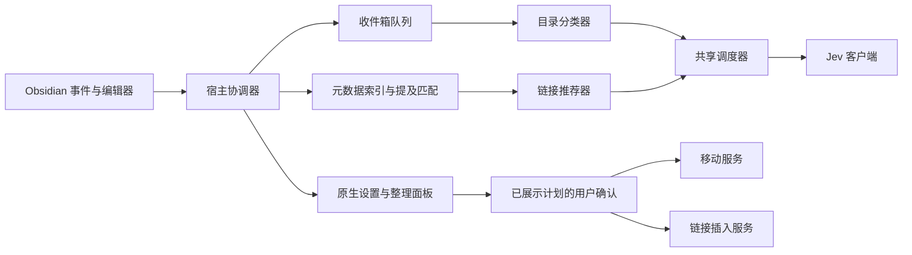

# 技术栈与模块接口

状态：0.1.0 开发预览已实现。本文描述当前代码；测试和宿主验证边界见 [验证记录](validation.md)。官方接口核查于 2026-09-22。

## 技术栈

| 层次 | 当前选择 |
| --- | --- |
| 语言与构建 | TypeScript 5.9.3，strict、noUncheckedIndexedAccess；esbuild 0.25.12，CommonJS / ES2021 |
| 宿主 | Obsidian 1.11.4+，桌面端；原生 Plugin、ItemView、PluginSettingTab、Setting、FuzzySuggestModal |
| 编辑器 | CM6 state 6.5.0 / view 6.38.6，与 Obsidian 类型包的 peer 要求一致；language 与 Lezer |
| 界面 | 原生 DOM、Obsidian CSS 变量；没有前端框架或额外图标运行时 |
| Jev | requestUrl → TypeSafe System One Choice；固定 jev-1.13.0 |
| 索引 | 标题／aliases 压缩前缀树、有限元数据；仅内存 |
| 状态 | loadData/saveData 保存设置、待办路径和移动记录；本机 local storage 保存自动开关和用量 |
| 凭据 | SecretComponent / SecretStorage；只保存密钥名称 |
| 验证 | Vitest 4.1.11、真实 CM6 与 Markdown 解析器、jsdom；ESLint 9 + typescript-eslint；tsc |

Node.js 仅用于开发，不要求最终用户运行后台服务。`obsidian`、`@codemirror/*`、`@lezer/*` 由宿主提供，构建为 external，避免重复编辑器实例。[官方模板](https://github.com/obsidianmd/obsidian-sample-plugin/blob/master/esbuild.config.mjs)

最低版本决定使用命令式 Setting 界面；没有采用新版本专属的声明式设置 API。当前没有启用 peer 依赖不兼容的 `eslint-plugin-obsidianmd`，本地 ESLint 限制 any、innerHTML 和 Node 文件系统导入。[Obsidian API](https://github.com/obsidianmd/obsidian-api/blob/master/obsidian.d.ts)

## 依赖与职责

纯领域模块不依赖 Obsidian、DOM 或磁盘。模型模块只返回候选选择，不持有写入能力。宿主协调器通过 port 注入实际读写，UI 仅调用准备和确认命令。

| 模块 | 接口定义 | 实现职责 |
| --- | --- | --- |
| folders | [types.ts](../src/folders/types.ts) | MemoryFolderCatalog：完整路径、范围、容器、继承说明、快照版本 |
| filing | [types.ts](../src/filing/types.ts) | StableInboxQueue、MixedDepthClassifier、ConfirmedMoveService |
| linking | [types.ts](../src/linking/types.ts) | MemoryMetadataIndex、LocalMentionMatcher、JevLinkRecommender、ConfirmedLinkService |
| jev | [types.ts](../src/jev/types.ts) | JevClient、响应校验、SharedDecisionScheduler、体积预算 |
| storage | [types.ts](../src/storage/types.ts) | PluginStateStore：串行持久化、移动日志、本机用量 |
| ui | [types.ts](../src/ui/types.ts) | OrganizerController、ReviewPanel、ItemView、设置和选择器 |
| obsidian | [controller.ts](../src/obsidian/controller.ts) | VaultAdapter、EditorSessions、公开 API 接入与生命周期 |

接口以链接到的 TypeScript 文件为准，文档不另维护一份可能漂移的声明。`saveSettings` 接收部分配置，串行合并到最新设置；失败不会覆盖有效状态。

## 归档流程

1. 订阅 create/modify/rename/delete，依路径边界判断 inbox。既有笔记仅在主动分析时入队。
2. 内容稳定 10 秒并且未处于活动编辑状态时分析。手动分析可读活动编辑器最新文本；执行移动必须与已保存内容一致。
3. 快照包含会话笔记身份、路径、变化版本和完整文本 SHA-256。发送正文去除 frontmatter，仅单独提取最多 8 个 tags。
4. 可直接存笔记的父目录、叶目录、空目录平等参与。最多 254 个实际目标直接比较，否则每组最多 64 个、每组提名 3 个，最多 64 组，再统一决选。不能跨组比较概率。
5. UI 展示最终路径；确认前核对来源、配置、目录版本、覆盖冲突和引用。先等待意图持久化，再调用 FileManager.renameFile，最后持久化结果。
6. 同一计划单次使用，同一笔记串行。保存意图失败不移动，移动后记账失败转为核对。撤销反向移动当前文件，保留最新正文。

目录 ID 是会话内短标识 `f1` 等，完整路径只出现在描述中。笔记 ID 由会话内 TFile 身份映射得到；不将上次会话数字 ID 当作持久身份。

Obsidian 公开 API 没有自动更新链接设置的 getter。当前实现只允许可证明保持解析的引用：检查出链在新位置的解析结果，入链仅允许唯一裸文件名等安全情况。显式旧路径、同名歧义或缓存未就绪时拒绝移动，可能比宿主实际能力更保守。重启后旧完成记录也转为核对，跨会话自动撤销暂未实现。

## 编辑与链接流程

1. 通过 registerEditorExtension / editorInfoField 绑定文件与 Editor；不访问未公开的 `.cm`。各编辑会话维护版本、最多 8 个变化范围与有限忽略记录。
2. 按键仅更新内存版本和计时器、使旧建议失效，不执行检索、磁盘持久化或全文复制。停顿 1 秒并结束 composition 后读取最多 1,200 UTF-16 单元窗口。
3. 复用 syntaxTree；解析未覆盖窗口就跳过。排除 code/math/link/url/image/frontmatter/yaml/html/comment/footnote 节点及局部链接标记。带 frontmatter 的笔记另读开头最多 1,200 单元作保护；其中未发现闭合标记时，整篇暂停补链。
4. 标题及 aliases 词条精确匹配，ASCII 大小写折叠，使用原始 UTF-16 偏移与字素边界。每次最多 128 次命中，同名目标超过 128 个跳过。每次最多 3 处建议，每处默认 8 个候选；截断处仍并列时跳过，不按路径猜选。
5. 周边上下文限定在锚点所在的允许文本范围；排除区中的内容不会因附近有匹配而附带发送。Jev 选择本次候选或放弃，纯内存缓存有界。
6. 确认时核对会话、原文、版本、语法、候选、目标解析、重复链接与格式偏好；重新生成的链接与预览不一致就失效。只有此时可额外扫描当前编辑器全文检查尚未保存的链接。
7. 通过一次 Editor.transaction 插入；普通撤销恢复原文。忽略随编辑映射，当前会话保留；手动重新查找可恢复。插入被撤销后抑制同位置自动推荐。

自动路径不读取候选正文、不 grep 全库、不建立持久索引。启动按 250 篇／4 ms 分批索引元数据；单文件更新做词条差量，目录改名与删除处理子树。保存事件会更新待办状态，不能把整个联网和保存流程描述为零写入。

语法排除已通过标准 Markdown 与 CM6 测试；Obsidian 的自定义语法、输入法和实际撤销历史仍需宿主测试，不能将节点名启发式当成完整的兼容性证明。

## 网络、预算与状态

Choice 最多 255 项，包含放弃项。内部 DTO 转换为 `state/model/questions`；响应验证模型、问题和选项集合、概率、confidence、usage。来源文本和候选描述始终当作资料，不赋予操作权限。[Choice](https://docs.typesafe.ai/primitives/choice)、[API](https://docs.typesafe.ai/api)

保守本地体积限制为状态加最大问题 30,000 UTF-8 字节、请求 60,000 字节，不声称是精确 token 计数。超限明确失败，不悄悄截断笔记。

共享调度器最多一个实际在途请求。手动任务、链接、后台归档依次优先，自动请求开始至少相隔 5 秒。401/403 暂停；429/5xx 有限重试并尊重 Retry-After，重试占用预算。请求逻辑取消或超时不会释放实际名额；requestUrl 没有公开的 AbortSignal，必须等传输结束。[requestUrl](https://docs.obsidian.md/Reference/TypeScript%20API/requestUrl)

每日额度发送前预留，返回后记录 token；超时、取消或退出导致无法确认的用量保留为未知。统计仅代表本机本插件，不能推导账户总账单。默认 100 次包括手动分析、连接检查和重试。

配置文件含 schemaVersion、settings、filingQueue、moveJournal。无正文、请求包、密钥值或持久化索引；损坏数据不覆盖。自动开关和用量用 vault 范围的本机 local storage，首次自动运行关闭。模型建议不跨重启保存，恢复待办等待手动操作。

所有事件由 Plugin 注册释放；卸载停止定时器、队列、索引分批工作和订阅。已发出的 HTTP 无法保证中止。宿主同步和外部文件编辑不受插件原子锁控制，确认流程会校验，但不能承诺跨进程事务。
